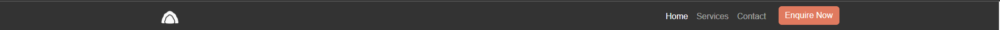
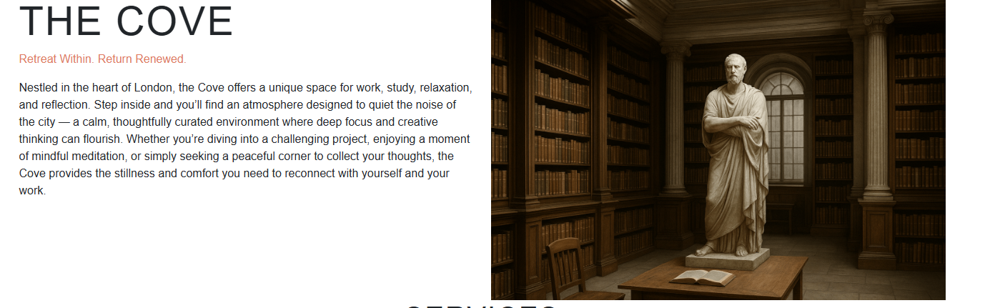
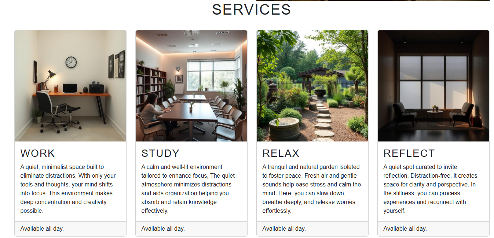
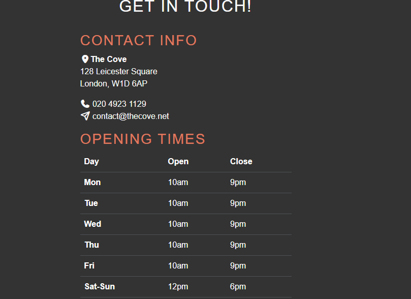
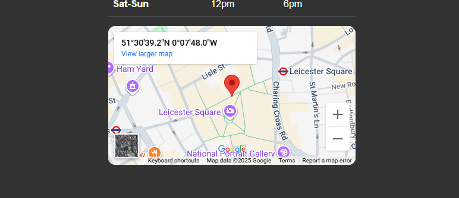

# THE COVE

A modern, responsive landing page for The Cove, a peaceful retreat in London designed for work, study, relaxation, and reflection. Built using HTML5, CSS3, and Bootstrap 5, the site highlights services, contact details, and location with a clean and user-friendly interface.

Features

# Responsive Navigation Bar
 Adapts to all screen sizes with a collapsible mobile menu.
* working call to action button which links to booking enquiery form
* Smooth scroll animation  to contact and services section

 # Hero Section 

 Introduction to The Cove with engaging text and imagery. 

 # Services Section
 Highlights the four key offerings: Work, Study, Relax, and Reflect.

# Contact & Info Section
Includes address, phone, email, opening times, and social links.

# Embedded Google Map 
 Easily locate The Cove in Leicester Square, London.
* pin redirects to google maps page if clicked

# Social Media Integration 
 Quick access to Facebook, X (Twitter), Instagram, and YouTube.

## Custom Styling 
 Additional styles applied via assets/css/style.css.

## Favicon Support

Multi-size favicons included for better browser support.
 used for icons in contact section and social media links

## Technologies Used

HTML5 – Semantic structure

CSS3 – Custom styling (style.css)

Bootstrap 5.3.7 – Layout & responsive design

Font Awesome – Icons for UI and social media

Google Maps Embed API – Location map

 
 
## Contact

The Cove  
128 Leicester Square, London,  
W1D 6AP      
020 4923 1129  
contact@thecove.net

 # Validation testing 
  ## HTML
  * No HTML errors were returned when passed through official W3C validator

  ## css
  * No CSS errors were returned when passed through  official WC3 validator 

  ## Accessability 
  * lighthouse performance report attached below
  

  ## Deployment 
  The site was deployed to github pages, steps to deploy are outlined below:

1 Go to your GitHub repo → Settings → Pages.

2 Under Build and deployment, choose:
 * Source: Deploy from a branch, 
 * Branch: main (or master) → /root

  
